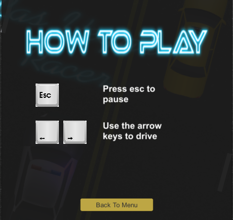

# MobileAppUnityProject 
 
### Game description:
Las Vegas Racer is a new PC racing game. Drive your car through highway traffic, earn bonuses, avoid bombs dropping from bandit’s cars, crash police cars. Try to keep all life’s and collect extra points for a clean ride.
### Features:
* Simple and easy to control and to play
* Nice and cool background music
* Realistic sound effects 
* Collect bonuses and to extend durability
* Great animations effects 
#### How to play?
 
#### Technologies used: 
* Unity
* C#
### How to run game in Unity
- Step 1: In command line or terminal type: git clone https://github.com/kamilam1987/MobileAppUnityProject.git 
- Step 2: Install Unity: https://unity3d.com/get-unity/download  
- Step 3: Create Unity account 
- Step 4: In Unity editor press Open and select CarGame folder 
- Step 5: Go to File, select Build & Run  
- Step 6: Set game configuration and press play.  

### How to take Unity game to Universal Windows Platform
Link to download Visual Studio 2015: 
https://www.visualstudio.com/vs/older-downloads/ 
Link how to open game in Visual Studio: 
https://unity3d.com/learn/tutorials/topics/scripting/taking-unity-games-universal-windows-platform 

### What is Unity?
Unity is a cross-platform game engine developed by Unity Technologies, which is primarily used to develop both three-dimensional and two-dimensional video games and simulations for computers, consoles, and mobile devices. First announced only for OS X at Apple's Worldwide Developers Conference in 2005, it has since been extended to target 27 platforms. Six major versions of Unity have been released. For a list of games made with Unity, visit List of Unity games.

### What is C#?
C# is a multi-paradigm programming language encompassing strong typing, imperative, declarative, functional, generic, object-oriented (class-based), and component-oriented programming disciplines. It was developed by Microsoft within its .NET initiative and later approved as a standard by Ecma (ECMA-334) and ISO (ISO/IEC 23270:2006). C# is one of the programming languages designed for the Common Language Infrastructure.

C# is a general-purpose, object-oriented programming language. Its development team is led by Anders Hejlsberg. The most recent version is C# 7.2, which was released in 2017 along with Visual Studio 2017 version 15.5.

### References:
https://en.wikipedia.org/wiki/Unity_(game_engine) 
https://unity3d.com/ 
https://www.youtube.com/channel/UCUhsAs8CaoD6B-xgtHP-ZhQ/featured 
https://opengameart.org/ 
http://wiki.unity3d.com/index.php/ArrayPrefs2#Usage 
https://en.wikipedia.org/wiki/C_Sharp_(programming_language) 

